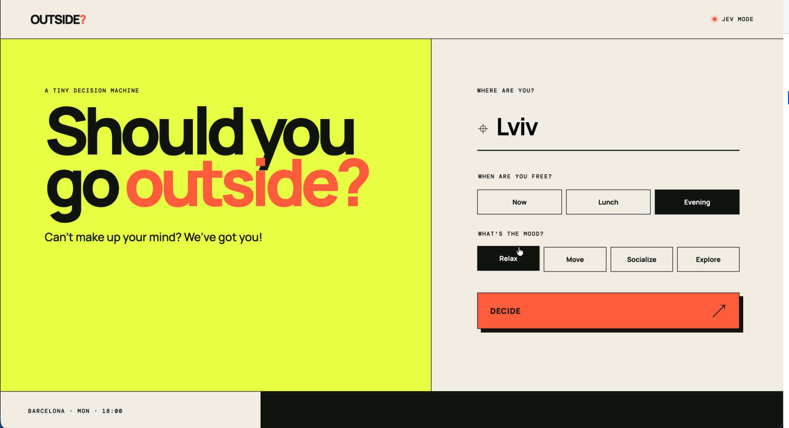

# Outside?

A tiny weather-aware decision app. It combines live forecast data from
[Open-Meteo](https://open-meteo.com/) with typed decisions from TypeSafe AI's
JEV model. Without a key it remains fully usable with a transparent local demo
decision.

<div align="center">
  
</div>

## Build and run as GraalVM Native Image

Demo mode needs no credentials.

Use a GraalVM distribution to build a native image:

```bash
mvn -Pnative native:compile
./target/decision-service
```


Pass the key at launch time to use JEV:

```bash
TYPESAFE_API_KEY="your-key" ./target/decision-service
```

Open <http://localhost:8080>. The badge in the top-right reports `DEMO MODE` or
`JEV MODE`, so it is always clear which decision engine answered.


## How the decision works

The backend sends JEV a structured weather-and-preference state and three
independent questions in one request:

- `Choice`: select a walk, run, outdoor café, exploration, social plan, or an
  indoor plan.
- `Noul`: estimate whether going outside is a good fit.
- `Score`: grade outdoor comfort from hostile to excellent.

JEV supplies decisions and probabilities; the application owns the possible
actions and the short display copy. Open-Meteo requires no key.
